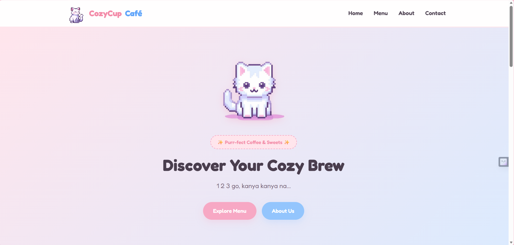
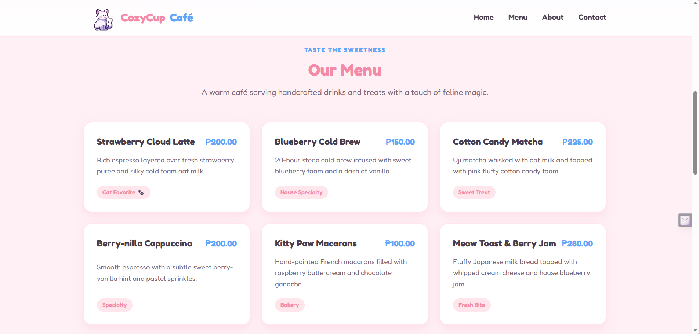
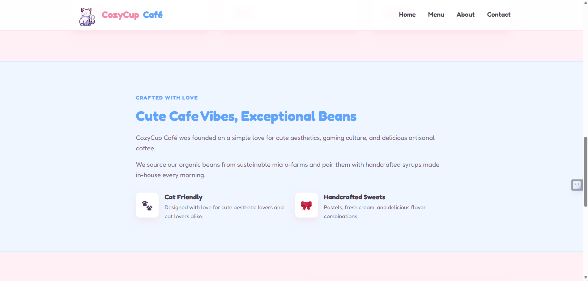
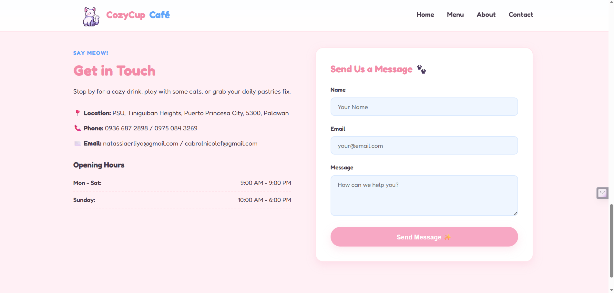

# Cozy Cup Café

## Project Description
Cozy Cup Cafe is a simple and cute cat-themed website for a coffee shop. It shows drinks, sweet treats, shop information, and contact details with nice colors and easy animations.

## Features
* **Navigation Bar:** Links that take you to different parts of the page smoothly.
* **Hero Section:** A cute moving pixel cat image to welcome visitors.
* **Food & Drink Menu:** Clear cards showing coffee, cold drinks, and desserts with prices.
* **About Us Section:** Short story about our coffee and love for cats.
* **Contact Section:** Opening hours, shop location, and a simple message form.

## Screen Captures

*Home section with the moving cat picture and welcome buttons.*

*Menu section showing drinks and food items with prices.*

*About section explaining what our café is about.*

*Contact section with location, open hours, and message box.*

## About the Authors

### Author 1

**Name:** **Nicole Ynarhosenne Faith F. Cabral**
**Email:** **cabralnicolef@gmail.com** 

---

### Author 2

**Name:** **Dayang Natassia Erliya M. Datu Amir Bahar**
**Email:** **natassiaerliya@gmail.com**  

